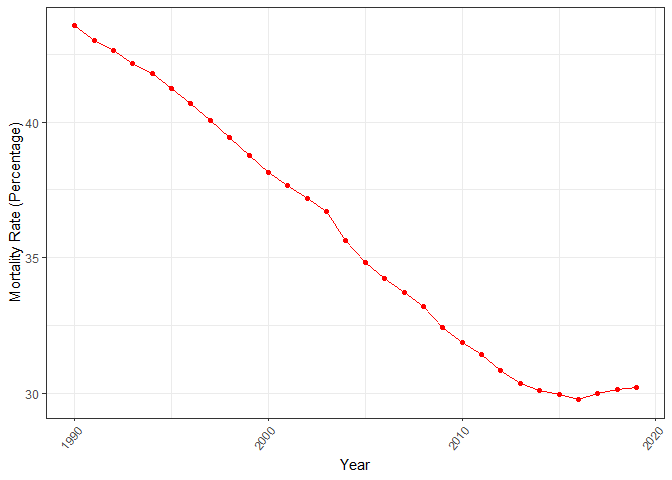

<!-- README.md is generated from README.Rmd. Please edit that file -->

# dislib

<!-- badges: start -->

[](https://lifecycle.r-lib.org/articles/stages.html#experimental)
<!-- badges: end -->

“dislib” or disease library is a package to provide information about
the diseases and their mortality rate. The original data are from [Our
world in Data](https://ourworldindata.org/what-does-the-world-die-from).
The purpose for the app is to provide easier access to the data and
allow users to analyse the information based on their interest.

You can access the package website through this
[link](https://etc5523-2022.github.io/rpkg-KrisanatA/)

## Installation

You can install the development version of dislib from
[GitHub](https://github.com/) with:

``` r
# install.packages("devtools")
devtools::install_github("etc5523-2022/rpkg-KrisanatA")
```

## Examples

``` r
library(dislib)
```

### The mortality rate overtime for Cardiovascular diseases in Australia:

``` r
plot_dis(disease = "Cardiovascular diseases", country = "Australia")
```



To examine how the mortality rate has evolved over time for the country
and years chosen.

### What diseases have the highest mortality rate in Australia for 2019:

``` r
dis_summary(country = "Australia", year = 2019)
#> # A tibble: 10 × 3
#>     Rank disease                                    Mortality_rate
#>    <dbl> <chr>                                               <dbl>
#>  1     1 Neoplasms                                           31.4 
#>  2     2 Cardiovascular diseases                             30.2 
#>  3     3 Alzheimer's disease and other dementias              6.58
#>  4     4 Chronic respiratory diseases                         6.56
#>  5     5 Digestive diseases                                   3.88
#>  6     6 Chronic kidney disease                               3.05
#>  7     7 Lower respiratory infections                         2.50
#>  8     8 Diabetes mellitus                                    2.48
#>  9     9 Parkinson's disease                                  1.41
#> 10    10 Cirrhosis and other chronic liver diseases           1.30
```

This function allows users to see the top 10 highest mortality rates for
the country and year chosen.

### Launching shiny app:

``` r
run_app()
```
